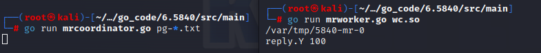
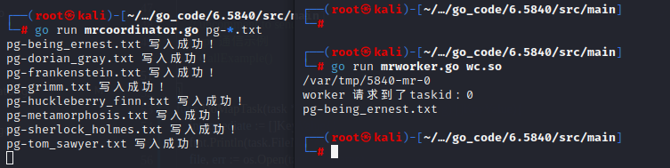
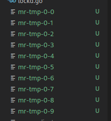
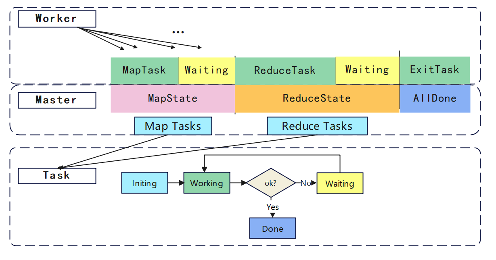
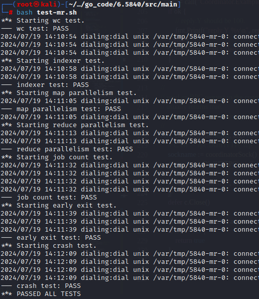

### 题目说明
题目地址：https://pdos.csail.mit.edu/6.824/labs/lab-mr.html

参考论文：https://pdos.csail.mit.edu/6.824/papers/mapreduce.pdf

### 实现
先尝试使用worker的CallExample()发送一个消息给启动后的master：



然后尝试构造任务的数据结构和master的数据结构：

```go
// 定义任务结构体
type Task struct{
	TaskType int // 任务状态
	FileName string // 文件切片
	TaskId int //任务id
	ReduceNum int// Reduce数量
}

//定义当前master信息结构体
type Coordinator struct {
	State int  // 当前所处阶段
	MapChan chan *Task // map的任务通道
	ReduceChan chan *Task // reduce的任务通道
	ReduceNum int // reduce数量
	Files []string //文件列表
}
```
worker进行rpc请求的数据为一个Task，任务id也是文件的id，reduceNum可以让map在进行存储中间文件时知道进行多少个文件分割。master启动后会把所有文件名放入Files，并生成对应的Map任务，并放入MapChan，State为当前的状态，是正在Map还是Reduce，然后启动server程序，等待worker进行远程调用。

work.go:

```go
func Worker(mapf func(string, string) []KeyValue, reducef func(string, []string) string) {
	task := GetTask()
	DoMapTask(&task, mapf)
}
// 获取任务
func GetTask() Task {
	args := TasskArgs{}	// 为空
	reply := Task{}
	if ok := call("Coordinator.PullTask", &args, &reply); ok {
		fmt.Printf("reply TaskId is %d\n", reply.TaskId)
	} else {
		fmt.Printf("call failed!\n")
	}
	return reply
}

// Map的制作
func DoMapTask(task *Task, mapf func(string, string) []KeyValue) {
	intermediate := []KeyValue{}
	fmt.Println(task.FileName)
	file, err := os.Open(task.FileName)
	if err != nil {
		log.Fatalf("cannot open %v", task.FileName)
	}
	content, err := ioutil.ReadAll(file)
	if err != nil {
		log.Fatalf("cannot read %v", task.FileName)
	}
	file.Close()
	reduceNum := task.ReduceNum
	intermediate = mapf(task.FileName, string(content))
	HashKv := make([][]KeyValue, reduceNum)
	for _, v := range(intermediate) {
		index := ihash(v.Key) % reduceNum
		HashKv[index] = append(HashKv[index], v)	// 将该kv键值对放入对应的下标
	}
	// 放入中间文件
	for i := 0; i < reduceNum; i++ {
		filename := "mr-tmp-" + strconv.Itoa(task.TaskId) + "-" + strconv.Itoa(i)
		new_file, err := os.Create(filename)
		if err != nil {
			log.Fatal("create file failed:", err)
		}
		enc := json.NewEncoder(new_file)	// 创建一个新的JSON编码器
		for _, kv := range(HashKv[i]) {
			err := enc.Encode(kv)
			if err != nil {
				log.Fatal("encode failed:", err)
			}
		}
		new_file.Close()
	}
}
```
coordinator.go

```go
func (c *Coordinator) PullTask(args *ExampleArgs, reply *Task) error {
	*reply = *<-c.MapChan
	return nil
}
func MakeCoordinator(files []string, nReduce int) *Coordinator {
	c := Coordinator{State: 0, 
					MapChan: make(chan *Task, len(files)),
					ReduceChan: make(chan *Task, nReduce),
					ReduceNum: nReduce,
					Files: files}
	// 制造Map任务
	c.MakeMapTasks(files)

	c.server()	// 启动RPC服务器
	return &c
}

// 将生成的任务放入map管道
func (c *Coordinator) MakeMapTasks(files []string) {
	for id, v := range(files) {
		// 生成任务
		task := Task {TaskType: MapTask,
					FileName: v,
					TaskId: id,
					ReduceNum: c.ReduceNum}
		c.MapChan <- &task	// 写入通道

		fmt.Println(v, "写入成功！")
	}
}
```
示例如下：






至此，已基本完成了Map任务，然后进行reduce任务的编写，这里照着lab给出的示例写：
worker.go
```go

func DoReduceTask(task *Task, reducef func(string, []string) string){
	reduceNum := task.TaskId
	intermediate := shuffle(task.FileName)
	finalName := fmt.Sprintf("mr-out-%d", reduceNum)
	ofile, err := os.Create(finalName)
	if err != nil{
		log.Fatal("创建文件失败：", err)
	}
	for i := 0; i < len(intermediate); {
		j := i+1
		for j < len(intermediate) && intermediate[j].Key == intermediate[i].Key{
			j++
		}
		values := []string{}
		for k := i; k < j; k++ {	// i和j之间是一样的键值对，将一样的到一个values中
			values = append(values, intermediate[k].Value)
		}
		output := reducef(intermediate[i].Key, values)
		fmt.Fprintf(ofile, "%v %v\n", intermediate[i].Key, output)
		i = j
	}
	ofile.Close()
}

// 排序，将reduce任务下的全部放一起
func shuffle(files []string) []KeyValue {
	kva := []KeyValue{}
	for _, fi := range files {
		file, err := os.Open(fi)
		if err != nil {
			log.Fatalf("cannot open %v", fi)
		}
		dec := json.NewDecoder(file)
		for {
			kv := KeyValue{}
			if err := dec.Decode(&kv); err != nil {
				break
			}
			kva = append(kva, kv)
		}
		file.Close()
	}
	sort.Sort(ByKey(kva))
	return kva
}
```
coordinator.go
```go
func (c *Coordinator) makeReduceTasks() {
	for i := 0; i < c.ReduceNum; i++ {
		id := i + len(c.Files)
		task := Task{
			TaskType: ReduceTask,
			FileName: selectReduceFiles(i),
			TaskId: id,
		}
		c.ReduceChan <- &task
	}
}
```
论文中说master会给出文件位置信息，其中这里传递给master也可以，因为都是mr-tmp前缀加数字，就不额外存储这些文件名称了。

work有了Map和Reduce就要考虑master如何给任务了，这也是这个lab的关键点之一。

worker需要针对master的不同状态做出不同的反应，因此worker的行为（状态）是取决于master的，master就设置了三种状态：执行map，执行reduce，任务全部完成。（如果细粒度一些就和worker同样的5种状态）。

worker的状态：执行map，所有map执行中等待，执行reduce，所有reduce执行中等待，任务全部完成。

然后是任务的状态，因为论文中提到worker crash，那个shall脚本会随机shut down一些worker，所以任务要有超时状态，超时后这个任务需要重新分配。

下面是逻辑图：



任务超时问题直接一个新的协程一直检查即可，然后state的更新肯定会在worker提交任务时刷新，并且再发送任务给worker时要检查一遍，会存在waiting变化到其他状态的情况。总体核心代码如下：
coordinator.go
```go
const MapTask = 1
const WaitingTask = 2
const ReduceTask = 3
const ExitTask = 4

const MapState = 1
const ReduceState = 2
const AllDone = 3

const Initing = -1
const Waiting = 1
const Working = 2

const Done = 0

var mu sync.Mutex

// 定义任务结构体
type Task struct{
	TaskType int // 任务类型
	FileName []string // 文件切片
	TaskId int //任务id
	ReduceNum int// Reduce数量
}

type TaskMetaInfo struct{
	TaskAddr *Task // 任务指针
	state int //任务运行状态
	BeginTime time.Time
}

// 保存全部任务的元数据
type TaskMetaHolder struct {
	MetaMap map[int]*TaskMetaInfo	
}

//定义当前master信息结构体
type Coordinator struct {
	State int  // 当前所处阶段
	MapChan chan *Task // map的任务通道
	ReduceChan chan *Task // reduce的任务通道
	ReduceNum int // reduce数量
	Files []string //文件列表
	taskMetaHolder TaskMetaHolder	// 任务信息
}

// 只有所有任务都处于Done才说明执行完毕
func (t *TaskMetaHolder) checkAllTasks() bool {
	UnDoneNum, DoneNum := 0, 0
	for _, v := range t.MetaMap {
		if v.state == Done {
			DoneNum++
		} else {
			UnDoneNum++
		}
	}
	if DoneNum > 0 && UnDoneNum == 0 {
		fmt.Println("任务全部执行完", DoneNum)
		return true
	} 
	return false
}

func (c *Coordinator) CheckTimeOut() {
	for {
		time.Sleep(2 * time.Second)	// 每2s检查一次
		mu.Lock()	// 因为要修改公共资源，需要加锁
		if c.State == AllDone {
			mu.Unlock()
			break
		}

		for _, v := range c.taskMetaHolder.MetaMap {
			if v.state == Working && time.Since(v.BeginTime) > 10*time.Second {	// 超时了
				// fmt.Printf("the task[ %d ] is crash,take [%d] s\n", v.TaskAddr.TaskId, time.Since(v.BeginTime))
				if v.TaskAddr.TaskType == MapTask {
					v.state = Waiting
					c.MapChan <- v.TaskAddr
				} else if v.TaskAddr.TaskType == ReduceTask {
					v.state = Waiting
					c.ReduceChan <- v.TaskAddr
				}
			}
		}
		mu.Unlock()
	}
}
// 任务状态的切换
func (c *Coordinator) MarkDone(args *Task, reply *Task) error { 
	mu.Lock()
	defer mu.Unlock()
	if c.taskMetaHolder.MetaMap[args.TaskId].state == Working {
		c.taskMetaHolder.MetaMap[args.TaskId].state = Done
	} else {
		// fmt.Printf("the task Id[%d] is finished,already ! ! !\n", args.TaskId)
	}
	// 检查所有任务是否执行完，判断是否进入下一个阶段
	if c.taskMetaHolder.checkAllTasks() {
		c.ToNextState()
	} 
	return nil
}

func (c *Coordinator) PullTask(args *ExampleArgs, reply *Task) error { 
	// 根据当前执行阶段返回对应任务
	// 发送完任务后，修改任务状态为working

	mu.Lock()
	defer mu.Unlock()

	// 所有任务处于working状态，则让worker先等一会
	
	tag := true
	for _, v := range c.taskMetaHolder.MetaMap {
		if v.state == Working || v.state == Done {// Initing和waiting状态可以发送出去
			
		} else {
			tag = false
			break
		}
	}

	if tag {
		*reply = Task {TaskType: WaitingTask}
		return nil
	}
	// 任务执行完了，让worker退出
	if c.State == ReduceState && c.taskMetaHolder.checkAllTasks() {
		*reply = Task {TaskType: ExitTask}
		return nil
	}
	if c.State == MapState{
		*reply = *<-c.MapChan
	}
	if c.State == ReduceState{
		*reply = *<-c.ReduceChan
	}
	_, ok := c.taskMetaHolder.MetaMap[reply.TaskId]
	if ok {
		c.taskMetaHolder.MetaMap[reply.TaskId].state = Working
		c.taskMetaHolder.MetaMap[reply.TaskId].BeginTime = time.Now()
	}
	return nil
}

func (c *Coordinator) Done() bool {
	ret := false
	if c.State == AllDone{
		ret = true
	}
	return ret
}


func MakeCoordinator(files []string, nReduce int) *Coordinator {
	c := Coordinator{State: MapState, 
		MapChan: make(chan *Task, len(files)),
		ReduceChan: make(chan *Task, nReduce),
		ReduceNum: nReduce,
		Files: files}

	// 制造Map任务
	c.MakeMapTasks(files)
	// 检查超时任务
	go c.CheckTimeOut()
	
	c.server()
	return &c
}

func (c *Coordinator) ToNextState() {
	if c.State == MapState {
		c.makeReduceTasks()
		c.State = ReduceState
		fmt.Println("State changed: ReduceState")
	} else if c.State == ReduceState {
		fmt.Println("State changed: AllDone")
		c.State = AllDone
	}
}


```
worker.go
```go
// for sorting by key. //KeyValue为一个键值对
type ByKey []KeyValue

// for sorting by key.//为了排序产生的三种方法
func (a ByKey) Len() int           { return len(a) }
func (a ByKey) Swap(i, j int)      { a[i], a[j] = a[j], a[i] }
func (a ByKey) Less(i, j int) bool { return a[i].Key < a[j].Key }

// 定义任务结构体
type TaskArgs struct{

}

type KeyValue struct {
	Key   string
	Value string
}

func ihash(key string) int {
	h := fnv.New32a()
	h.Write([]byte(key))
	return int(h.Sum32() & 0x7fffffff)
}


func Worker(mapf func(string, string) []KeyValue, reducef func(string, []string) string) {
	// Your worker implementation here.
	alive := true // 任务没完成就一直向master要任务做
	for alive{
		task := GetTask()
		switch task.TaskType{
			case MapTask:{
				DoMapTask(&task, mapf)
				TaskDone(&task)
			}
			case WaitingTask:{
				fmt.Println("所有任务执行中，wait Mapping...")
				time.Sleep(1 * time.Second)
			}
			case ReduceTask: {
				DoReduceTask(&task, reducef)
				TaskDone(&task)
			}
			case ExitTask:{
				fmt.Println("所有任务执行中，wait Reducing...")
				alive = false
			}
		}
	}
}

func TaskDone(task *Task) {
	args := task
	reply := Task{}
	ok := call("Coordinator.MarkDone", &args, &reply)
	if ok {
		// fmt.Println("Task Done!")
	}
}

func GetTask() Task{
	args := TaskArgs{}
	reply := Task{}
	if ok := call("Coordinator.PullTask", &args, &reply); ok{
		// fmt.Printf("worker 请求到了taskid：%d\n", reply.TaskId)
	}else{
		fmt.Printf("worker 请求失败")
	}
	return reply
}

```

注意多个worker请求修改的数据会存在并发问题，chan也同意有这个问题，这里直接加了锁，相当于master顺序执行了。

注释掉无关打印信息，执行如下：



### 代码：
#### coordinator.go

```
package mr

// import "fmt"
import "log"
import "net"
import "os"
import "net/rpc"
import "net/http"
import "strings"
import "io/ioutil"
import "strconv"
import "time"
import "sync"

const MapTask = 1
const WaitingTask = 2
const ReduceTask = 3
const ExitTask = 4

const MapState = 1
const ReduceState = 2
const AllDone = 3

const Initing = -1
const Waiting = 1
const Working = 2

const Done = 0

var mu sync.Mutex

// 定义任务结构体
type Task struct{
	TaskType int // 任务类型
	FileName []string // 文件切片
	TaskId int //任务id
	ReduceNum int// Reduce数量
}

type TaskMetaInfo struct{
	TaskAddr *Task // 任务指针
	state int //任务运行状态
	BeginTime time.Time
}

// 保存全部任务的元数据
type TaskMetaHolder struct {
	MetaMap map[int]*TaskMetaInfo	
}

//定义当前master信息结构体
type Coordinator struct {
	State int  // 当前所处阶段
	MapChan chan *Task // map的任务通道
	ReduceChan chan *Task // reduce的任务通道
	ReduceNum int // reduce数量
	Files []string //文件列表
	taskMetaHolder TaskMetaHolder	// 任务信息
}


// Your code here -- RPC handlers for the worker to call.
// 下面写被rpc调用的方法


//
// an example RPC handler.
//
// the RPC argument and reply types are defined in rpc.go.
//
// 这个函数用来更正工作状态、修改工作超时时间
func (t *TaskMetaHolder) judgeState(taskId int) bool {
	taskInfo, ok := t.MetaMap[taskId] 
	if !ok || taskInfo.state != Waiting {
		return false	// 不用修改
	}
	taskInfo.state = Working
	taskInfo.BeginTime = time.Now()
	return true
}
// 只有所有任务都处于Done才说明执行完毕
func (t *TaskMetaHolder) checkAllTasks() bool {
	UnDoneNum, DoneNum := 0, 0
	for _, v := range t.MetaMap {
		if v.state == Done {
			DoneNum++
		} else {
			UnDoneNum++
		}
	}
	if DoneNum > 0 && UnDoneNum == 0 {
		// fmt.Println("任务全部执行完", DoneNum)
		return true
	} 
	return false
}

func (c *Coordinator) CheckTimeOut() {
	for {
		time.Sleep(2 * time.Second)	// 每2s检查一次
		mu.Lock()	// 因为要修改公共资源，需要加锁
		if c.State == AllDone {
			mu.Unlock()
			break
		}

		for _, v := range c.taskMetaHolder.MetaMap {
			if v.state == Working && time.Since(v.BeginTime) > 10*time.Second {	// 超时了
				// fmt.Printf("the task[ %d ] is crash,take [%d] s\n", v.TaskAddr.TaskId, time.Since(v.BeginTime))
				if v.TaskAddr.TaskType == MapTask {
					v.state = Waiting
					c.MapChan <- v.TaskAddr
				} else if v.TaskAddr.TaskType == ReduceTask {
					v.state = Waiting
					c.ReduceChan <- v.TaskAddr
				}
			}
		}
		mu.Unlock()
	}
}
// 任务状态的切换
func (c *Coordinator) MarkDone(args *Task, reply *Task) error { 
	mu.Lock()
	defer mu.Unlock()
	if c.taskMetaHolder.MetaMap[args.TaskId].state == Working {
		c.taskMetaHolder.MetaMap[args.TaskId].state = Done
	} else {
		// fmt.Printf("the task Id[%d] is finished,already ! ! !\n", args.TaskId)
	}
	// 检查所有任务是否执行完，判断是否进入下一个阶段
	if c.taskMetaHolder.checkAllTasks() {
		c.ToNextState()
	} 
	return nil
}


func selectReduceFiles(reduceNum int) []string {
	s := []string{}
	path, _ := os.Getwd()	// 当前工作目录
	files, _ := ioutil.ReadDir(path)
	for _, f := range files {
		if strings.HasPrefix(f.Name(), "mr-tmp-") && strings.HasSuffix(f.Name(), strconv.Itoa(reduceNum)) {
			s = append(s, f.Name())
		}
	}
	return s
}

func (c *Coordinator) PullTask(args *ExampleArgs, reply *Task) error { 
	// 根据当前执行阶段返回对应任务
	// 发送完任务后，修改任务状态为working

	mu.Lock()
	defer mu.Unlock()

	// 所有任务处于working状态，则让worker先等一会
	
	tag := true
	for _, v := range c.taskMetaHolder.MetaMap {
		if v.state == Working || v.state == Done {// Initing和waiting状态可以发送出去
			
		} else {
			tag = false
			break
		}
	}

	if tag {
		*reply = Task {TaskType: WaitingTask}
		return nil
	}
	// 任务执行完了，让worker退出
	if c.State == ReduceState && c.taskMetaHolder.checkAllTasks() {
		*reply = Task {TaskType: ExitTask}
		return nil
	}
	if c.State == MapState{
		*reply = *<-c.MapChan
	}
	if c.State == ReduceState{
		*reply = *<-c.ReduceChan
	}
	_, ok := c.taskMetaHolder.MetaMap[reply.TaskId]
	if ok {
		c.taskMetaHolder.MetaMap[reply.TaskId].state = Working
		c.taskMetaHolder.MetaMap[reply.TaskId].BeginTime = time.Now()
	}
	return nil
}


//
// main/mrcoordinator.go calls Done() periodically to find out
// if the entire job has finished.
//
func (c *Coordinator) Done() bool {
	ret := false
	if c.State == AllDone{
		ret = true
	}
	return ret
}

//
// create a Coordinator.
// main/mrcoordinator.go calls this function.
// nReduce is the number of reduce tasks to use.
//
func MakeCoordinator(files []string, nReduce int) *Coordinator {
	c := Coordinator{State: MapState, 
		MapChan: make(chan *Task, len(files)),
		ReduceChan: make(chan *Task, nReduce),
		ReduceNum: nReduce,
		Files: files}

	// 制造Map任务
	c.MakeMapTasks(files)
	// 检查超时任务
	go c.CheckTimeOut()
	
	c.server()
	return &c
}

// 将生成的任务放入map管道
func (c *Coordinator) MakeMapTasks(files []string) {
	c.taskMetaHolder.MetaMap = make(map[int]*TaskMetaInfo)
	for id, v := range(files) {
		// 生成任务
		task := Task {TaskType: MapTask,
					FileName: []string{v},
					TaskId: id,
					ReduceNum: c.ReduceNum}
		taskMetaInfo := TaskMetaInfo{
			TaskAddr: &task,
			state : Initing ,//任务运行状态
		}
		c.taskMetaHolder.MetaMap[id] = &taskMetaInfo	// 文件名长度后面是新的Reduce任务坐标
		c.MapChan <- &task	// 写入通道
		// fmt.Println(v, "写入成功！")
	}
}

//
// start a thread that listens for RPCs from worker.go
//
func (c *Coordinator) server() {
	rpc.Register(c)
	rpc.HandleHTTP()
	//l, e := net.Listen("tcp", ":1234")
	sockname := coordinatorSock()
	os.Remove(sockname)
	l, e := net.Listen("unix", sockname)
	if e != nil {
		log.Fatal("listen error:", e)
	}
	go http.Serve(l, nil)
}

func (c *Coordinator) ToNextState() {
	if c.State == MapState {
		c.makeReduceTasks()
		c.State = ReduceState
		// fmt.Println("State changed: ReduceState")
	} else if c.State == ReduceState {
		// fmt.Println("State changed: AllDone")
		c.State = AllDone
	}
}

func (c *Coordinator) makeReduceTasks() {
	for i := 0; i < c.ReduceNum; i++ {
		id := i + len(c.Files)
		task := Task{
			TaskType: ReduceTask,
			FileName: selectReduceFiles(i),
			TaskId: id,
		}
		taskMetaInfo := TaskMetaInfo{
			TaskAddr: &task,
			state : Initing ,//任务运行状态
		}
		c.taskMetaHolder.MetaMap[id] = &taskMetaInfo	// 文件名长度后面是新的Reduce任务坐标
		c.ReduceChan <- &task
	}
}

```

#### rpc.go

```

package mr

//
// RPC definitions.
//
// remember to capitalize all names.
//

import "os"
import "strconv"

//
// example to show how to declare the arguments
// and reply for an RPC.
//

type ExampleArgs struct {
	X int
}

type ExampleReply struct {
	Y int
}

// Add your RPC definitions here.


// Cook up a unique-ish UNIX-domain socket name
// in /var/tmp, for the coordinator.
// Can't use the current directory since
// Athena AFS doesn't support UNIX-domain sockets.
func coordinatorSock() string {
	s := "/var/tmp/5840-mr-"
	s += strconv.Itoa(os.Getuid())
	return s
}

```

#### worker.go

```

package mr

import "fmt"
import "log"
import "net/rpc"
import "hash/fnv"
import "io/ioutil"
import "strconv"
import "encoding/json"
import "os"
import "time"
import "sort"


// for sorting by key. //KeyValue为一个键值对
type ByKey []KeyValue

// for sorting by key.//为了排序产生的三种方法
func (a ByKey) Len() int           { return len(a) }
func (a ByKey) Swap(i, j int)      { a[i], a[j] = a[j], a[i] }
func (a ByKey) Less(i, j int) bool { return a[i].Key < a[j].Key }

// 定义任务结构体
type TaskArgs struct{

}

//
// Map functions return a slice of KeyValue.
//
type KeyValue struct {
	Key   string
	Value string
}

//
// use ihash(key) % NReduce to choose the reduce
// task number for each KeyValue emitted by Map.
//
func ihash(key string) int {
	h := fnv.New32a()
	h.Write([]byte(key))
	return int(h.Sum32() & 0x7fffffff)
}


//
// main/mrworker.go calls this function.
// 两个参数分别是
//
func Worker(mapf func(string, string) []KeyValue, reducef func(string, []string) string) {

	// Your worker implementation here.
	alive := true // 任务没完成就一直向master要任务做
	for alive{
		task := GetTask()
		switch task.TaskType{
			case MapTask:{
				DoMapTask(&task, mapf)
				TaskDone(&task)
			}
			case WaitingTask:{
				// fmt.Println("所有任务执行中，wait Mapping...")
				time.Sleep(1 * time.Second)
			}
			case ReduceTask: {
				DoReduceTask(&task, reducef)
				TaskDone(&task)
			}
			case ExitTask:{
				// fmt.Println("所有任务执行中，wait Reducing...")
				alive = false
			}
		}
	}
	// uncomment to send the Example RPC to the coordinator.
	// rpc 通信示例
	// CallExample()

}

func DoReduceTask(task *Task, reducef func(string, []string) string){
	reduceNum := task.TaskId
	intermediate := shuffle(task.FileName)
	finalName := fmt.Sprintf("mr-out-%d", reduceNum)
	ofile, err := os.Create(finalName)
	if err != nil{
		log.Fatal("创建文件失败：", err)
	}
	for i := 0; i < len(intermediate); {
		j := i+1
		for j < len(intermediate) && intermediate[j].Key == intermediate[i].Key{
			j++
		}
		values := []string{}
		for k := i; k < j; k++ {	// i和j之间是一样的键值对，将一样的到一个values中
			values = append(values, intermediate[k].Value)
		}
		output := reducef(intermediate[i].Key, values)
		fmt.Fprintf(ofile, "%v %v\n", intermediate[i].Key, output)
		i = j
	}
	ofile.Close()
}

// 排序，将reduce任务下的全部放一起
func shuffle(files []string) []KeyValue {
	kva := []KeyValue{}
	for _, fi := range files {
		file, err := os.Open(fi)
		if err != nil {
			log.Fatalf("cannot open %v", fi)
		}
		dec := json.NewDecoder(file)
		for {
			kv := KeyValue{}
			if err := dec.Decode(&kv); err != nil {
				break
			}
			kva = append(kva, kv)
		}
		file.Close()
	}
	sort.Sort(ByKey(kva))
	return kva
}


func TaskDone(task *Task) {
	args := task
	reply := Task{}
	ok := call("Coordinator.MarkDone", &args, &reply)
	if ok {
		// fmt.Println("Task Done!")
	}
}


func DoMapTask(task *Task,  mapf func(string, string) []KeyValue){//读取文件，使用mapf进行map操作，写入中间文件
	intermediate := []KeyValue{}
	file, err := os.Open(task.FileName[0])
	if err != nil{
		log.Fatalf("打开文件失败：%v", task.FileName)
	}
	content, err := ioutil.ReadAll(file)
	if err != nil{
		log.Fatalf("不能读取文件 %v", task.FileName)
	}
	file.Close()
	reduceNum := task.ReduceNum
	intermediate = mapf(task.FileName[0], string(content))
	HashKv := make([][]KeyValue, reduceNum)
	for _, v := range(intermediate){
		index := ihash(v.Key) % reduceNum
		HashKv[index] = append(HashKv[index], v)
	}
	// 存入中间文件
	for i := 0; i < reduceNum; i++{
		filename := "mr-tmp-" + strconv.Itoa(task.TaskId) + "-" + strconv.Itoa(i)
		new_file, err := os.Create(filename)
		if err != nil{
			log.Fatal("创建文件失败： ", err)
		}
		enc := json.NewEncoder(new_file)
		for _, kv := range(HashKv[i]){
			err := enc.Encode(kv)
			if err != nil{
				log.Fatal("编码失败:", err)
			}
		}
		new_file.Close()
	}
}
//
// example function to show how to make an RPC call to the coordinator.
//
// the RPC argument and reply types are defined in rpc.go.
//请求一个任务
func GetTask() Task{
	args := TaskArgs{}
	reply := Task{}
	if ok := call("Coordinator.PullTask", &args, &reply); ok{
		// fmt.Printf("worker 请求到了taskid：%d\n", reply.TaskId)
	}else{
		fmt.Printf("worker 请求失败")
	}
	return reply
}
func CallExample() {

	// declare an argument structure.
	args := ExampleArgs{}

	// fill in the argument(s).
	args.X = 99

	// declare a reply structure.
	reply := ExampleReply{}

	// send the RPC request, wait for the reply.
	// the "Coordinator.Example" tells the
	// receiving server that we'd like to call
	// the Example() method of struct Coordinator.
	ok := call("Coordinator.Example", &args, &reply)
	if ok {
		// reply.Y should be 100.
		fmt.Printf("reply.Y %v\n", reply.Y)
	} else {
		fmt.Printf("call failed!\n")
	}
}

//
// send an RPC request to the coordinator, wait for the response.
// usually returns true.
// returns false if something goes wrong.
//
func call(rpcname string, args interface{}, reply interface{}) bool {
	// c, err := rpc.DialHTTP("tcp", "127.0.0.1"+":1234")
	sockname := coordinatorSock()
	c, err := rpc.DialHTTP("unix", sockname)
	if err != nil {
		log.Fatal("dialing:", err)
	}
	defer c.Close()

	err = c.Call(rpcname, args, reply)
	if err == nil {
		return true
	}
	return false
}
