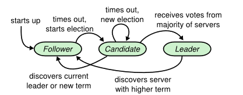
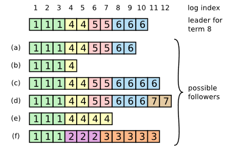
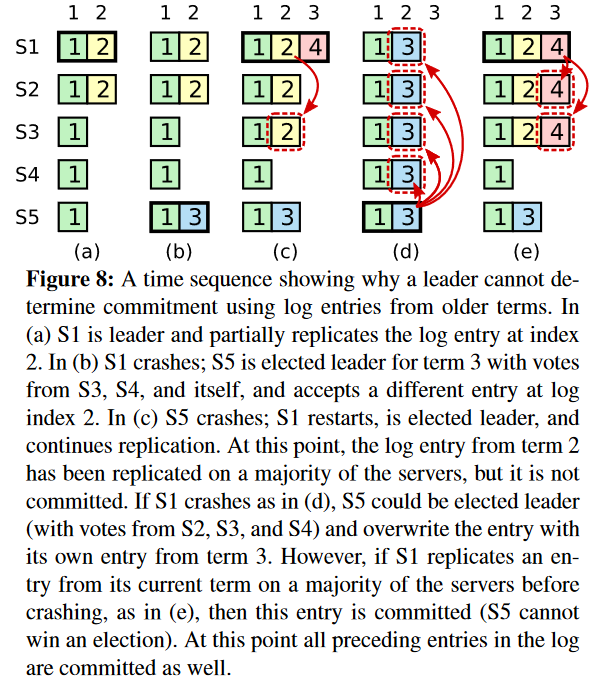

### 题目说明

题目地址：http://nil.csail.mit.edu/6.824/2021/labs/lab-raft.html
参考论文：http://nil.csail.mit.edu/6.824/2021/papers/raft-extended.pdf

### 思路
领导者选举过程：



可能存在的日志复制情况：



leader会使用最后相同索引，持续覆盖每个follower的日志，直到其和自己一致。

例如上图的leader会把下面2和3term的日志都删掉（覆盖）

安全性的领导选举：

follower只会给比自己日志新的raft投票，保证commit的不丢失。

新leader可能存在老leader给的没有提交的日志，新leader不会单独去自己提交，会通过在自己任期内产生一个日志，然后前面的未提交日志随着自己任期的第一个日志提交。




#### 2A:
实现Raft领导者的选举和心跳功能。

测试： 
- 测试初始状态产生新leader
- 测试老leader宕机，产生新leader后老leader回归不影响新leader
- 7个节点的集群中随机删除三个，然后找到一个新leader，重复十次操作

#### 2B:
实现领导者和跟随者的日志功能。
测试：
- 测试一次简单提交（重复三次），流程：使用start提交一个日志，判断日志是否被集群commit
- rpc字节计数，每个命令只发送一次
- 断开一个follower，然后发送写操作，然后重新启动这个follower（follower宕机）
- 5个节点，宕机其中三个非leader节点，然后发送请求判断是否被提交（正常leader不能提交这个请求），然后恢复在发送一个新请求
- 

#### 2C：
实现Raft重启的机器从中断位置开始恢复日志。（需要在重启前进行持久化）

#### 2D：
2c的情况下日志落盘会越来越多，实现日志压缩和日志快照

### 实现

#### Make函数

用来创建raft服务器。（ test文件里面使用make_config()调用start1（）在调用make创建raft）

- 初始化配置
- 开启日志同步协程
- 开启超时协程（心跳或者等待心跳超时（新选举））

```go
func Make(
peers []*labrpc.ClientEnd, //记录所有服务器
me int, // 自己在peers中的位置
persister *Persister,
applyCh chan ApplyMsg,
) *Raft {
    rf := &Raft{
    peers:          peers,
    persister:      persister,
    me:             me,
    dead:           0,
    applyCh:        applyCh,
    replicatorCond: make([]*sync.Cond, len(peers)),
    state:          StateFollower, // 初始为follower状态
    currentTerm:    0,             // 初始任期号
    votedFor:       -1,            // 投票给谁？
    logs:           make([]Entry, 1),
    nextIndex:      make([]int, len(peers)),
    matchIndex:     make([]int, len(peers)),
    heartbeatTimer: time.NewTimer(StableHeartbeatTimeout()),
    electionTimer:  time.NewTimer(RandomizedElectionTimeout()),
    }
    // initialize from state persisted before a crash
    rf.readPersist(persister.ReadRaftState()) // 刚创建，试图读取之前的持久化信息
    rf.applyCond = sync.NewCond(&rf.mu)       // 初始化锁
    lastLog := rf.getLastLog()
    for i := 0; i < len(peers); i++ {
    rf.matchIndex[i], rf.nextIndex[i] = 0, lastLog.Index+1
    if i != rf.me {
    rf.replicatorCond[i] = sync.NewCond(&sync.Mutex{})
    // start replicator goroutine to replicate entries in batch
    go rf.replicator(i) // 启动复制器
    }
    }
    // start ticker goroutine to start elections
    go rf.ticker() // 处理心跳和心跳等待超时
    // start applier goroutine to push committed logs into applyCh exactly once
    go rf.applier() // 是否有需要应用到状态机的日志
    
    return rf
}
```

#### 两个定时器

```go
const (
	HeartbeatTimeout = 125  // 心跳时间
	ElectionTimeout  = 1000 // 心跳超时时间
)

func StableHeartbeatTimeout() time.Duration {
	return time.Duration(HeartbeatTimeout) * time.Millisecond
}

func RandomizedElectionTimeout() time.Duration { // 随机化，便于使用先发优势
	return time.Duration(ElectionTimeout+globalRand.Intn(ElectionTimeout)) * time.Millisecond
}
```

#### 心跳和重新选举

```go

func (rf *Raft) ticker() {
	for rf.killed() == false {
		select {
		case <-rf.electionTimer.C: // 开始新选举
			rf.mu.Lock()
			rf.ChangeState(StateCandidate)
			rf.currentTerm += 1
			rf.StartElection()
			rf.electionTimer.Reset(RandomizedElectionTimeout())
			rf.mu.Unlock()
		case <-rf.heartbeatTimer.C: // 发送心跳
			rf.mu.Lock()
			if rf.state == StateLeader {
				rf.BroadcastHeartbeat(true) // leader在心跳时间发送心跳
				rf.heartbeatTimer.Reset(StableHeartbeatTimeout())
			}
			rf.mu.Unlock()
		}
	}
}

```
#### 开启新选票

```go

func (rf *Raft) StartElection() { // 开始选举
	request := rf.genRequestVoteRequest() // 拉票的参数：自己的日志信息、和任期号日志号
	DPrintf("{Node %v} starts election with RequestVoteRequest %v", rf.me, request)
	// use Closure
	grantedVotes := 1
	rf.votedFor = rf.me // 给自己投票
	rf.persist()        // 持久化
	for peer := range rf.peers {
		if peer == rf.me {
			continue
		}
		go func(peer int) {
			response := new(RequestVoteResponse)
			if rf.sendRequestVote(peer, request, response) { // 发送拉票请求
				rf.mu.Lock()
				defer rf.mu.Unlock()
				DPrintf("{Node %v} receives RequestVoteResponse %v from {Node %v} after sending RequestVoteRequest %v in term %v", rf.me, response, peer, request, rf.currentTerm)
				if rf.currentTerm == request.Term && rf.state == StateCandidate { // 收到自己拉票的信息，如果currentTerm被改（前面的协程），则这次拉票没有意义
					if response.VoteGranted { // 收到票
						grantedVotes += 1
						if grantedVotes > len(rf.peers)/2 {
							DPrintf("{Node %v} receives majority votes in term %v", rf.me, rf.currentTerm)
							rf.ChangeState(StateLeader)
							rf.BroadcastHeartbeat(true)
						}
					} else if response.Term > rf.currentTerm { // 别人任期号更大，自己又变成follower
						DPrintf("{Node %v} finds a new leader {Node %v} with term %v and steps down in term %v", rf.me, peer, response.Term, rf.currentTerm)
						rf.ChangeState(StateFollower)
						rf.currentTerm, rf.votedFor = response.Term, -1
						rf.persist()
					}
				}
			}
		}(peer)
	}
}

```

#### 


